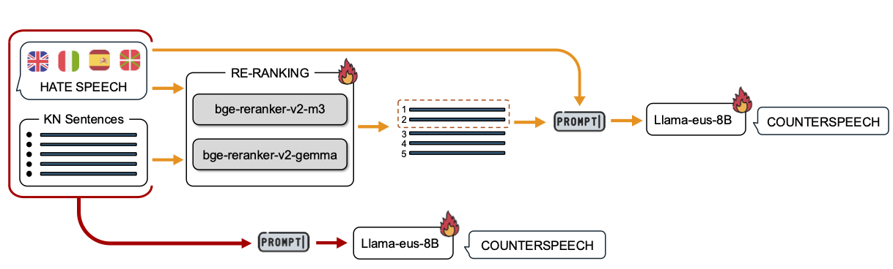
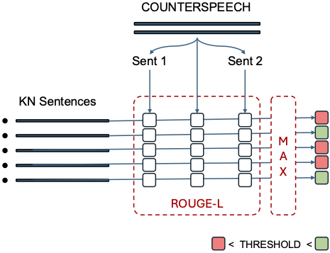

# TrenTeam at Multilingual Counterspeech Generation: Multilingual Passage Re-Ranking Approaches for Knowledge-Driven Counterspeech Generation Against Hate

This repository contains the code and data for our paper titled "TrenTeam at Multilingual Counterspeech Generation: Multilingual Passage Re-Ranking Approaches for Knowledge-Driven Counterspeech Generation Against Hate." This work is the result of our participation in the Shared Task on Multilingual Counterspeech Generation held at COLING 2025.

## System Description

In this paper, we propose a knowledge-driven approach to counterspeech (CS) generation. Specifically, we focus on the passage re-ranking module by incorporating state-of-the-art re-ranking mechanisms into the knowledge-driven CS generation pipeline. To evaluate our approach, we tested the performance of multilingual cross-encoders and LLM-based re-rankers on the MT-CONAN-KN dataset. We compared re-ranker-based systems to a simpler end-to-end approach, where all available information—hate speech and retrieved knowledge—was directly passed to an LLM tasked with selecting the appropriate knowledge and generating a CS grounded in it.



## Repository Structure

- `download_data.py`: This script downloads the datasets from HuggingFace and saves them in the `data` folder.
- `pre_process_train_data.py`: This script computes ROUGE scores and creates the training data for the re-rankers. [See Data Preprocessing Details](#data-preprocessing-details)
- `prompt.py`: This script contains the prompts used for both the LLM-based re-ranker and the generation of counterspeeches.

## Data Preprocessing Details

A qualitative analysis of the MT-CONAN-KN dataset revealed substantial overlap between the CS and one or more knowledge sentences. To identify which knowledge sentences were used to compose each CS, we employed ROUGE-L as a metric, which measures the similarity between texts based on their longest common subsequences (LCS). Specifically, we calculated the ROUGE-L score between each CS sentence and the corresponding knowledge sentences. For cases where a single knowledge sentence was used to write multiple CS sentences, we also computed the ROUGE-L score for the entire CS against each knowledge sentence. Finally, we kept the highest ROUGE-L scores for each knowledge sentence; the knowledge sentences whose ROUGE score exceeded a specific threshold were labeled as those used to write the CS. A threshold of 35% was chosen to ensure at least one positive sentence per hate speech in the training set. A subset of the annotated data has been manually checked to ensure the effectiveness of this annotation strategy.



### Script Details 
The `pre_process_train_data.py` script can be run with the following arguments:
1. `-dataset`: str (train, dev, or test)
2. `-llm_reranker`: bool (true if using LLM-based re-ranker)
3. `-threshold`: float between 0.0 and 1.0 (threshold value for selecting positive and negative examples for re-ranker fine-tuning)

The script can be run without any specifications using the default values. The command is: 

```console
python pre_process_train_data.py
```

The default values are:

- `dataset: train`

- `llm_reranker: False`

- `threshold: 0.35`

These parameters can be easily modified. For example:

```console
python pre_process_train_data.py -dataset dev -llm_reranker True -threshold 0.5
```

The script will save the ROUGE scores and the input re-ranker training data in the data folder with the names `{dataset}_rl_scores.json` and `reranker_{dataset}(_LLM).jsonl` respectively.

## Citation

If you use this code or data in your research, please cite our paper: 

```bibtex
@inproceedings{russo-2025-TrenTeam,
  title={TrenTeam at Multilingual Counterspeech Generation: Passage Re-Ranking Approaches for Knowledge-Driven Counterspeech Generation Against Hate},
  author={Russo, Daniel},
  year={2025}
}
